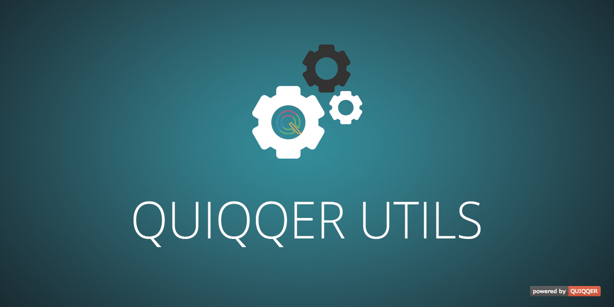

QUIQQER Utils
========

Helper-Classes from and for QUIQQER.  
These classes (have to) work independently from QUIQQER.


Package Name:

    quiqqer/utils


Features
--------

- Database-Layer -> easy connection to/via PDO
- QDOM -> DOM-like classes for PHP
- PHP QUI Control Class
- Request, Security, Math, Sting Utils (Helpers)


Installation
------------

The package name is: `quiqqer/utils`


Contribute
----------

- Issue Tracker: https://dev.quiqqer.com/quiqqer/qutils/issues
- Source Code: https://dev.quiqqer.com/quiqqer/qutils/tree/master


Support
-------

If you found any flaws, have any wishes or suggestions you can send an email
to [support@pcsg.de](mailto:support@pcsg.de) to inform us about your concerns.  
We will try to respond to your request and forward it to the responsible developer.


License
-------

LGPL-3.0+


Usage
--------

**composer.json**


```javascript
{
    "repositories": [{
        "type": "composer",
        "url": "http://update.quiqqer.com"
    }],

    "require": {
        "quiqqer/utils" : "1.*"
    }
}
```


**PHPUNIT**

```bash
phpunit  -c phpunit/tests.xml
```
